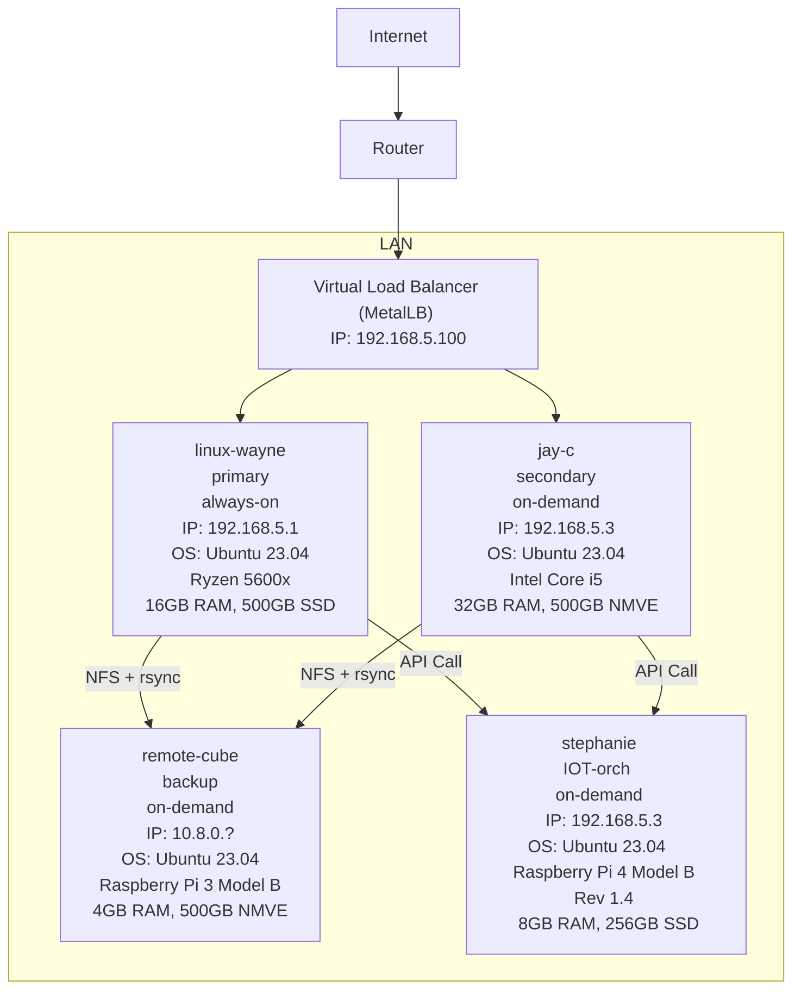

## Technical Architecture

```mermaid
graph TD;
    Internet --> Router;
    Router --> LoadBalancer;
    
    subgraph LAN[LAN]
        LoadBalancer --> S1;
        LoadBalancer --> S3;
        S1 -->|NFS + rsync| S4;
        S3 -->|NFS + rsync| S4;
        S1 -->|API Call| S2;
        S3 -->|API Call| S2;
        
        LoadBalancer["Virtual Load Balancer (MetalLB) <br>IP: 192.168.5.100"];
        S1["linux-wayne <br>primary     <br>always-on   <br>IP: 192.168.5.1 <br>OS: Ubuntu 23.04    <br>Ryzen 5600x   <br> 16GB RAM, 500GB SSD"];
        S3["jay-c       <br>secondary   <br>on-demand   <br>IP: 192.168.5.3 <br>OS: Ubuntu 23.04    <br>Intel Core i5 <br> 32GB RAM, 500GB NMVE"];
        S2["stephanie   <br>IOT-orch    <br>on-demand   <br>IP: 192.168.5.3 <br>OS: Ubuntu 23.04    <br>Raspberry Pi 4 Model B Rev 1.4 <br> 8GB RAM, 256GB SSD"];
        S4["remote-cube <br>backup      <br>on-demand   <br>IP: 10.8.0.?    <br>OS: Ubuntu 23.04    <br>Raspberry Pi 3 Model B <br> 4GB RAM, 500GB NMVE"];
    end;

```